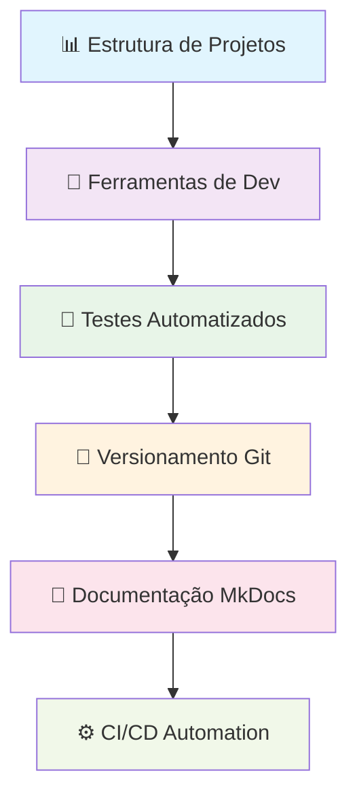
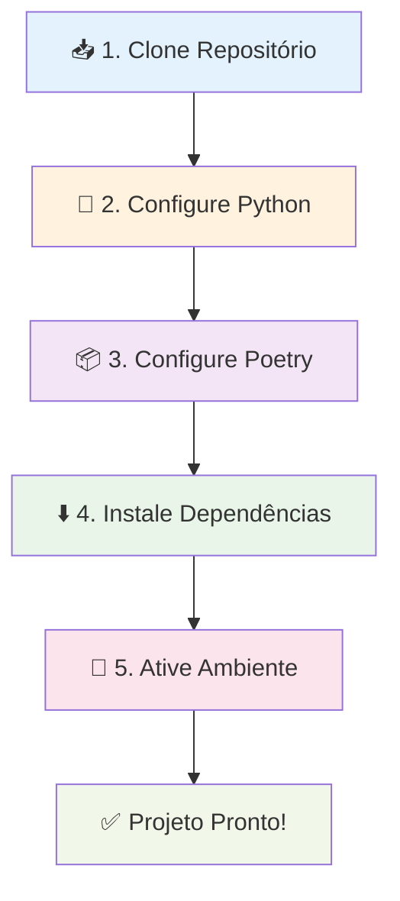
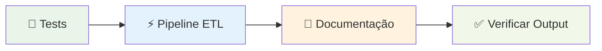
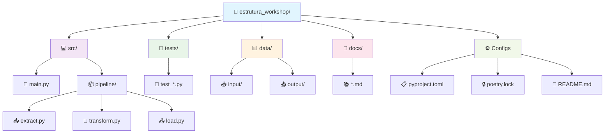
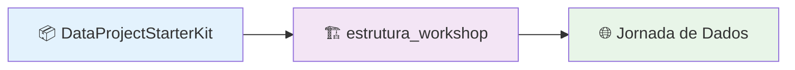
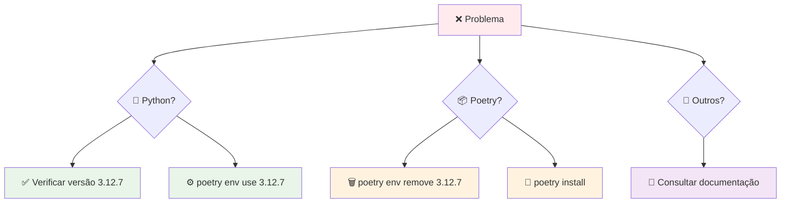
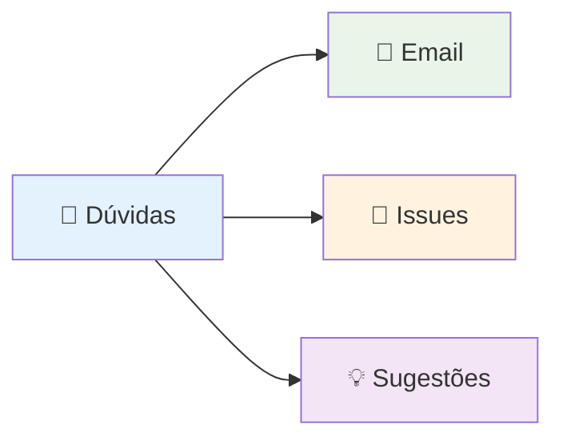

# 🚀 Data Project Starter Kit

<div align="center">

[](https://codecov.io/gh/ulissesbomjardim/estrutura_workshop)
[](https://www.python.org)
[](https://python-poetry.org)
[](https://ulissesbomjardim.github.io/estrutura_workshop/)

</div>

## 📚 Documentação

A documentação completa do projeto está disponível em:

**🌐 [https://ulissesbomjardim.github.io/estrutura_workshop/](https://ulissesbomjardim.github.io/estrutura_workshop/)**

---

## 🎯 Sobre o Projeto

Este repositório é uma **estrutura profissional** para o workshop **"Como estruturar um projeto de dados do Zero"**.

### 🌟 Objetivos Principais



**🎊 Novo workshop disponível em 29/01!**

### 🎯 Objetivos do Workshop

| 🎯 **Módulo** | 📖 **Conteúdo** | 🛠️ **Ferramentas** |
|---------------|------------------|---------------------|
| 📂 **Estrutura** | Organização padronizada de projetos | `src/`, `tests/`, `docs/`, `data/` |
| 🏗️ **Arquitetura** | Classes, módulos e ETL profissional | `Python`, `OOP`, `Design Patterns` |
| 🔧 **Ambiente** | Ambientes virtuais e dependências | `Poetry`, `Pyenv`, `pip` |
| 🧪 **Testes** | Testes unitários e de integração | `Pytest`, `Coverage`, `CI/CD` |
| 📝 **Versionamento** | Controle de versão e colaboração | `Git`, `GitHub`, `Branching` |
| 📖 **Documentação** | Documentação profissional | `MkDocs`, `GitHub Pages` |
| ⚙️ **Automação** | Integração e entrega contínua | `GitHub Actions`, `Pre-commit` |

## 🚀 Começando

### 📋 Pré-requisitos


#### 🛠️ **Ferramentas Necessárias**

| 🛠️ **Ferramenta** | 📖 **Descrição** | 🔗 **Links Úteis** |
|-------------------|------------------|---------------------|
| 💻 **VSCode** | Editor de código principal | [📥 Download](https://code.visualstudio.com/download) |
| 🔧 **Git** | Controle de versão | [📖 Instalação](https://git-scm.com/book/pt-br/v2) |
| 🌐 **GitHub** | Plataforma de repositórios | [📝 Criar Conta](https://docs.github.com/pt/get-started/onboarding/getting-started-with-your-github-account) |
| 🐍 **Python 3.12.7** | Linguagem de programação | [🎥 Tutorial Pyenv](https://www.youtube.com/watch?v=TkcqjLu1dgA) |
| 📦 **Poetry** | Gerenciador de dependências | [📚 Documentação](https://python-poetry.org/docs/#installation) |

#### 🎥 **Tutoriais Recomendados**

- **🪟 Windows Git/GitHub**: [YouTube Tutorial](https://www.youtube.com/watch?v=_hZf1teRFNg)
- **🐍 Pyenv Windows**: [Tutorial Pyenv](https://www.youtube.com/watch?v=TkcqjLu1dgA)
- **📦 Poetry Windows**: [Tutorial Poetry](https://www.youtube.com/watch?v=BuepZYn1xT8)
- **📖 Git Básico**: [Ebook LinkedIn](https://www.linkedin.com/feed/update/urn:li:activity:7093915148351864832/)

#### ⚡ **Instalação Rápida do Poetry**

```bash
pip install poetry
```

### ⚙️ Configuração do Projeto



#### 📥 **1. Clone o Repositório**

```bash
git clone https://github.com/ulissesbomjardim/estrutura_workshop.git
cd estrutura_workshop
```

#### 🐍 **2. Configure Python 3.12.7**

```bash
# Se estiver usando Pyenv
pyenv install 3.12.7
pyenv local 3.12.7
```

> **💡 Nota**: O projeto já possui arquivo `.python-version` especificando Python 3.12.7

#### 📦 **3. Configure Poetry**

```bash
poetry env use 3.12.7
```

#### ⬇️ **4. Instale as Dependências**

```bash
poetry install
```

**🎯 O que este comando faz:**

- ✅ Cria ambiente virtual automaticamente
- ✅ Instala dependências do `pyproject.toml`
- ✅ Instala ferramentas de desenvolvimento (`pytest`, `black`, `isort`)

#### 🚀 **5. Ative o Ambiente Virtual**

```bash
poetry shell
```

### ⚡ Executando o Projeto



#### 🧪 **6. Execute os Testes**

```bash
# Com Poetry shell ativo
task test

# Ou sem ativar o shell
poetry run task test
```

#### ⚡ **7. Execute a Pipeline ETL**

```bash
# Com Poetry shell ativo
task run

# Ou sem ativar o shell
poetry run task run
```

**📊 Processo ETL:**
- 📥 **Input**: Arquivos Excel em `data/input/`
- ⚙️ **Processamento**: Executa `src/main.py`
- 📤 **Output**: Resultado em `data/output/`

#### 📖 **8. Execute a Documentação**

```bash
# Com Poetry shell ativo
task doc

# Ou sem ativar o shell
poetry run task doc
```

**🌐 Acesse**: `http://localhost:8000` para visualizar a documentação

#### ✅ **9. Verificar Resultados**

Confira se os arquivos foram gerados corretamente em `data/output/`

## 🛠️ Comandos Úteis

### 🎨 **Formatação de Código**

```bash
# ✅ Recomendado: via Poetry
poetry run task format

# 🔄 Alternativa: ativando o ambiente
$path = poetry env info --path
& "$path\Scripts\Activate.ps1"
task format
```

### 🚀 **Ativação Manual do Ambiente**

#### 🪟 **Windows PowerShell**
```powershell
$path = poetry env info --path
& "$path\Scripts\Activate.ps1"
```

#### 🪟 **Windows CMD**
```cmd
poetry env info --path
# Copie o caminho e execute: <caminho>\Scripts\activate.bat
```

#### 🐧 **Linux/Mac**
```bash
source $(poetry env info --path)/bin/activate
```

### 📊 **Testes e Coverage**

```bash
# Testes com relatório de cobertura
poetry run pytest --cov=src --cov-report=xml

# Informações do ambiente Poetry
poetry env info
```

### ⚡ **Comandos Rápidos**

| 🎯 **Comando** | 📖 **Descrição** | 🚀 **Execução** |
|---------------|------------------|------------------|
| 🧪 `task test` | Executa testes | `poetry run task test` |
| ⚡ `task run` | Executa pipeline | `poetry run task run` |
| 🎨 `task format` | Formata código | `poetry run task format` |
| 📖 `task doc` | Inicia documentação | `poetry run task doc` |

## 📁 Estrutura do Projeto



### 🗂️ **Detalhamento dos Diretórios**

| 📁 **Diretório** | 📖 **Descrição** | 🎯 **Propósito** |
|------------------|------------------|-------------------|
| `💻 src/` | Código fonte principal | Lógica de negócio e pipeline ETL |
| `🧪 tests/` | Testes unitários | Garantia de qualidade e cobertura |
| `📊 data/input/` | Arquivos de entrada | Dados Excel para processamento |
| `📊 data/output/` | Arquivos processados | Resultados da pipeline ETL |
| `📖 docs/` | Documentação | Guias e referências MkDocs |
| `⚙️ pyproject.toml` | Configuração Poetry | Dependências e metadados |
| `🔒 poetry.lock` | Lock de dependências | Versões fixas para reprodutibilidade |

## 📚 Recursos de Aprendizado

### 📖 **Ebooks Recomendados**

| 📚 **Ebook** | 🎯 **Tema** | 🔗 **Link** |
|--------------|-------------|-------------|
| 🧪 **Ebook 1** | Testes em Python | [📖 Acessar](https://www.linkedin.com/feed/update/urn:li:activity:7099722252144848896/) |
| ⚙️ **Ebook 2** | GitHub Actions CI/CD | [📖 Acessar](https://www.linkedin.com/feed/update/urn:li:activity:7098264928553201665/) |
| 💻 **Ebook 3** | "Na minha máquina funciona" | [📖 Acessar](https://www.linkedin.com/feed/update/urn:li:activity:7095419109449814017/) |

### 🔗 **Referências Importantes**



| 🎯 **Recurso** | 📖 **Descrição** | 🔗 **Link** |
|----------------|------------------|-------------|
| 📦 **Starter Kit Original** | Template base do projeto | [🔗 GitHub](https://github.com/lvgalvao/DataProjectStarterKit) |
| 🏗️ **Workshop Base** | Repositório do workshop | [🔗 GitHub](https://github.com/lvgalvao/estrutura_workshop) |
| 🌐 **Jornada de Dados** | Site oficial da comunidade | [🔗 Website](https://suajornadadedados.com.br/) |

## 🔧 Solução de Problemas



### 🐍 **Problemas com Python**

| ❌ **Sintoma** | 🔧 **Solução** |
|---------------|----------------|
| Versão incorreta | `pyenv install 3.12.7 && pyenv local 3.12.7` |
| Poetry não reconhece | `poetry env use 3.12.7` |

### 📦 **Problemas com Poetry**

| ❌ **Sintoma** | 🔧 **Solução** |
|---------------|----------------|
| Conflitos de dependências | `poetry env remove 3.12.7 && poetry install` |
| Ambiente corrompido | `poetry env remove --all && poetry install` |

### ✅ **Comandos de Diagnóstico**

```bash
# Verificar Poetry
poetry --version
poetry env list
poetry env info

# Verificar Python
python --version
which python  # Linux/Mac
where python  # Windows
```

## 📞 Contato e Suporte

<div align="center">



</div>

### 🤝 **Como Contribuir**

| 🎯 **Tipo** | 📖 **Descrição** | 🔗 **Canal** |
|-------------|------------------|--------------|
| 📧 **Email** | Dúvidas e feedbacks diretos | [ulisses.bomjardim@gmail.com](mailto:ulisses.bomjardim@gmail.com) |
| 🐛 **Issues** | Reportar bugs e problemas | [🔗 GitHub Issues](https://github.com/ulissesbomjardim/estrutura_workshop/issues) |
| 💡 **Features** | Sugestões de melhorias | [🔗 GitHub Discussions](https://github.com/ulissesbomjardim/estrutura_workshop/discussions) |
| ⭐ **Suporte** | Curtir o projeto | [🔗 GitHub Star](https://github.com/ulissesbomjardim/estrutura_workshop) |

---

<div align="center">

**🎉 Obrigado por usar o Data Project Starter Kit! 🎉**

*📅 Última atualização: 2025-10-16*

[](https://github.com/ulissesbomjardim/estrutura_workshop)
[](https://github.com/ulissesbomjardim/estrutura_workshop/fork)

</div>
