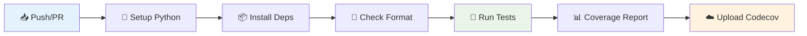
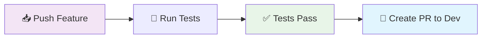
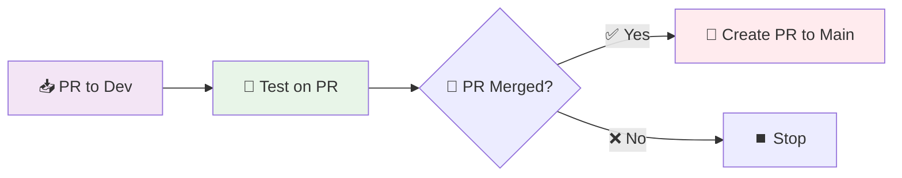

# 🚀 CI — Integração e Entrega Contínua

Esta página explica os workflows do GitHub Actions configurados para automatizar testes, verificações de qualidade e deployment.

---

## 🎯 Visão Geral do CI/CD

O projeto utiliza **GitHub Actions** para:

- ✅ **Execução automática de testes**
- 🔍 **Verificação de qualidade de código**
- 📊 **Relatórios de cobertura**
- 🔄 **Criação automática de Pull Requests**
- 🚀 **Deployment da documentação**

---

## 📋 Workflows Configurados

### 🔧 1. `ci.yml` — Pipeline Principal

**📅 Quando executa**: Push e Pull Requests para `main` e `dev`



**🔧 Configuração**:
- **🐍 Python**: 3.12 no Ubuntu
- **📦 Dependências**: pandas, openpyxl, pytest, black, isort
- **🎨 Formatação**: `black --check`
- **🧪 Testes**: `pytest` com cobertura
- **📊 Cobertura**: Upload para Codecov (se token configurado)

**🔑 Secrets Necessários**:
- `CODECOV_TOKEN` (opcional)
- `ACTIONS_PUSH_TOKEN` (se necessário)

---

### 🔀 2. `push-create-pr.yml` — PRs Automáticos

**📅 Quando executa**: Push em branches `feature/**` e `test/**`



**⚙️ Funcionalidades**:
- **🧪 Executa testes** na branch feature
- **🔀 Cria PR automaticamente** para `dev`
- **🔄 Atualiza PR existente** se já criado

**🔑 Permissões**: `contents: write`, `pull-requests: write`

---

### 🔄 3. `create-pr-dev-to-main.yml` — Deploy para Main

**📅 Quando executa**: PRs envolvendo branch `dev`



**⚙️ Funcionalidades**:
- **🧪 Testa PRs** para `dev`
- **🚀 Cria PR** `dev → main` automaticamente após merge
- **📝 Usa template** `.github/PULL_REQUEST_TEMPLATE.md`

---

## 🔧 Configuração e Setup

### 🔑 1. Configurar Secrets

Acesse: **Settings → Secrets and variables → Actions**

#### 📊 Para Codecov (Opcional):
```bash
# Obtenha o token em codecov.io
CODECOV_TOKEN=<seu-token>
```

#### 🔐 Para Push Token (Se necessário):
```bash
ACTIONS_PUSH_TOKEN=<token-com-permissoes>
```

### ⚙️ 2. Configurar Permissões

Certifique-se de que os workflows têm permissões adequadas:

```yaml
permissions:
  contents: write           # Para criar branches/commits
  pull-requests: write      # Para criar/atualizar PRs
```

### 🛡️ 3. Proteger Branches

Configure proteção para `main` e `dev`:

- ✅ **Require status checks** antes do merge
- ✅ **Require branches to be up to date**
- ✅ **Require pull request reviews**

---

## 🔍 Monitoramento e Debug

### 📊 Verificar Execução

1. **Acesse**: Repository → **Actions**
2. **Visualize**: Workflows em execução/concluídos
3. **Debug**: Clique no workflow para ver logs detalhados

### 🧪 Testar Localmente

#### 🐳 Usando Act (Opcional):
```bash
# Instalar act
choco install act  # Windows
brew install act   # macOS

# Executar workflow localmente
act -j test
```

#### ⚠️ **Limitações do Act**:
- Nem todos os recursos funcionam
- Pode precisar de configuração adicional

---

## 🔄 Fluxo de Trabalho Recomendado

### 📝 1. Desenvolvimento:
```bash
# Criar branch feature
git checkout -b feature/nova-funcionalidade

# Fazer alterações e commit
git add .
git commit -m "feat: adiciona nova funcionalidade"

# Push para origem
git push -u origin feature/nova-funcionalidade
```

### 🤖 2. Automação:
- ✅ **Workflow executa testes** automaticamente
- 🔀 **PR criado** para `dev` automaticamente
- 📧 **Notificação** enviada para revisão

### 👀 3. Revisão:
- 📋 **Revisar código** no PR
- ✅ **Aprovar** se tudo estiver correto
- 🔀 **Merge** para `dev`

### 🚀 4. Deploy:
- 🤖 **PR automático** `dev → main` criado
- 📋 **Revisão final** se necessário
- 🚀 **Deploy** para produção

---

## 🛠️ Troubleshooting

### ❌ **Workflow falha em "Setup Python"**
**Solução**: Verificar versão Python no workflow
```yaml
- uses: actions/setup-python@v4
  with:
    python-version: '3.12.7'  # Versão específica
```

### ❌ **Erro de permissão para criar PR**
**Solução**: Verificar token e permissões
```yaml
permissions:
  contents: write
  pull-requests: write
```

### ❌ **Codecov upload falha**
**Solução**: Verificar se token está configurado ou remover upload
```yaml
- name: Upload to Codecov
  if: env.CODECOV_TOKEN  # Só executa se token existe
```

### ❌ **Testes falham apenas no CI**
**Solução**: Verificar dependências e ambiente
```bash
# Reproduzir ambiente do CI localmente
poetry install
poetry run pytest --cov=src
```

---

## 📈 Métricas e Relatórios

### 📊 Cobertura de Código
- **Codecov**: Relatórios online de cobertura
- **Badge**: Adicionar badge no README
- **Histórico**: Acompanhar evolução da cobertura

### ⏱️ Performance dos Testes
- **Tempo de execução**: Monitorar duração dos workflows
- **Otimização**: Cache de dependências quando possível

---

## 🔗 Próximos Passos

- 🧪 **Execute os Testes**: [🧪 Tests](tests.md)
- 🐍 **Configure Python**: [🐍 Pyenv](pyenv.md)
- 🔧 **Configure Hooks**: [🔍 Pre-commit](precommit.md)
- 📂 **Configure Git**: [📂 Git](git.md)
