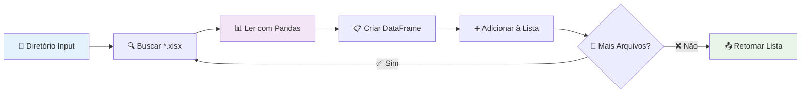

# 📥 Extract — Módulo de Extração

Este módulo é responsável pela extração de dados de arquivos Excel no pipeline ETL.

---

## 🎯 Visão Geral

O módulo `extract.py` é o primeiro estágio do pipeline ETL, responsável por:

- 📁 **Localizar** arquivos Excel (`.xlsx`) em diretórios
- 📊 **Ler** dados usando pandas
- 📋 **Converter** cada arquivo em DataFrame
- 📤 **Retornar** lista de DataFrames para processamento

---

## 🔧 Funcionalidades

### ✅ **Capacidades**:
- 🔍 Busca automática de arquivos `.xlsx`
- 📊 Leitura com pandas (engine openpyxl)
- 🔄 Processamento de múltiplos arquivos
- 📋 Retorno estruturado em lista

### ⚡ **Performance**:
- 🚀 Processamento eficiente com pandas
- 💾 Carregamento sob demanda
- 🔄 Suporte a arquivos grandes

---

## 📖 Documentação da API

### 🎯 **Função Principal**

::: src.pipeline.extract.extract_from_excel

---

## 💻 Exemplos de Uso

### 📁 **Uso Básico**
```python
from pipeline.extract import extract_from_excel

# Extrair dados de arquivos Excel
data_list = extract_from_excel("data/input")
print(f"Arquivos processados: {len(data_list)}")

# Verificar shapes dos DataFrames
for i, df in enumerate(data_list):
    print(f"Arquivo {i+1}: {df.shape}")
```

### 🔍 **Verificação de Dados**
```python
# Verificar se há dados
if data_list:
    print("✅ Dados extraídos com sucesso!")
    for df in data_list:
        print(f"Colunas: {list(df.columns)}")
        print(f"Linhas: {len(df)}")
else:
    print("❌ Nenhum arquivo encontrado")
```

### 🧪 **Análise Exploratória**
```python
# Inspecionar dados extraídos
for i, df in enumerate(data_list):
    print(f"\n📊 Arquivo {i+1}:")
    print(f"📋 Shape: {df.shape}")
    print(f"🏷️ Colunas: {list(df.columns)}")
    print(f"📈 Info:")
    df.info()
    print(f"🔍 Preview:")
    print(df.head())
```

---

## 🔄 Fluxo de Execução



---

## ⚙️ Comportamento Detalhado

### 📁 **Busca de Arquivos**
- **Padrão**: `*.xlsx` no diretório especificado
- **Método**: `glob.glob()` para busca eficiente
- **Recursivo**: Não (apenas diretório especificado)

### 📊 **Leitura de Dados**
- **Engine**: `openpyxl` (para arquivos .xlsx)
- **Encoding**: Automático (pandas detecta)
- **Headers**: Primeira linha como cabeçalho (padrão)

### 🔄 **Processamento**
- **Sequencial**: Um arquivo por vez
- **Acumulação**: Lista de DataFrames
- **Memória**: Todos os DataFrames mantidos em memória

---

## 🛠️ Tratamento de Erros

### ❌ **Cenários de Erro Comuns**

#### 📁 **Diretório não encontrado**
```python
import os
if not os.path.exists(input_path):
    print(f"❌ Diretório não encontrado: {input_path}")
```

#### 📄 **Arquivo corrompido**
```python
try:
    data_list = extract_from_excel("data/input")
except Exception as e:
    print(f"❌ Erro na leitura: {e}")
```

#### 🔒 **Arquivo em uso**
- **Problema**: Arquivo aberto no Excel
- **Solução**: Fechar Excel e tentar novamente

---

## 🚀 Melhorias Possíveis

### 🔧 **Robustez**
```python
# Tratamento de erros por arquivo
def extract_with_error_handling(input_path: str):
    valid_files = []
    errors = []

    for file_path in glob.glob(os.path.join(input_path, "*.xlsx")):
        try:
            df = pd.read_excel(file_path)
            valid_files.append(df)
        except Exception as e:
            errors.append((file_path, str(e)))

    return valid_files, errors
```

### ⚡ **Performance**
```python
# Leitura paralela (para muitos arquivos)
from concurrent.futures import ThreadPoolExecutor

def extract_parallel(input_path: str):
    files = glob.glob(os.path.join(input_path, "*.xlsx"))

    with ThreadPoolExecutor() as executor:
        dataframes = list(executor.map(pd.read_excel, files))

    return dataframes
```

### 🔍 **Validação**
```python
# Validação de schema
def validate_schema(df: pd.DataFrame, required_columns: list):
    missing_columns = set(required_columns) - set(df.columns)
    if missing_columns:
        raise ValueError(f"Colunas faltando: {missing_columns}")
```

---

## 📊 Formatos Suportados

### ✅ **Suportados**
- **Excel (.xlsx)**: Formato principal
- **Excel (.xls)**: Com adaptação do código

### 🔄 **Extensões Possíveis**
- **CSV**: Adaptar para `pd.read_csv()`
- **Parquet**: Adaptar para `pd.read_parquet()`
- **JSON**: Adaptar para `pd.read_json()`

---

## 🧪 Testes

### 📋 **Testes Incluídos**
- ✅ Leitura de arquivos válidos
- ✅ Tratamento de diretório vazio
- ✅ Validação do formato de retorno
- ✅ Comportamento com múltiplos arquivos

### 🔧 **Executar Testes**
```bash
# Testes específicos do módulo extract
poetry run pytest tests/test_extract.py -v

# Com cobertura
poetry run pytest tests/test_extract.py --cov=src.pipeline.extract
```

---

## 🔗 Próximos Passos

- 🔄 **Transform**: [⚙️ Transform](transform.md) - Próximo estágio do pipeline
- 📤 **Load**: [📤 Load](load.md) - Estágio final
- 🎯 **Main**: [🎯 Main](main.md) - Orquestração completa
- 📖 **Overview**: [📖 Código](codigo.md) - Visão geral da arquitetura
