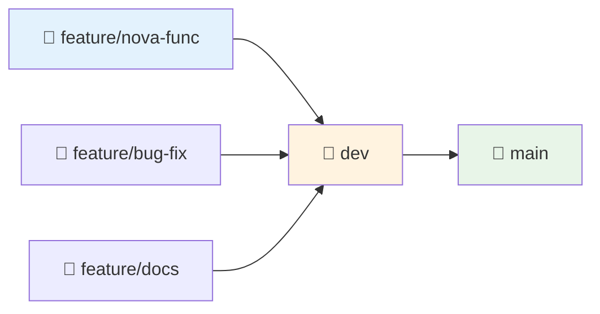

# 📂 Git e GitHub — Controle de Versão

Esta página explica os conceitos fundamentais do Git e GitHub, como configurar o projeto e trabalhar com versionamento e colaboração.

---

## 🎯 Visão Geral

### 🔄 **Git vs GitHub**:
- **Git**: Sistema de controle de versão distribuído
- **GitHub**: Plataforma para hospedar repositórios Git na nuvem
- **Benefícios**: Histórico, colaboração, backup, CI/CD

---

## 📁 Estrutura de Arquivos Git

### 🔒 **`.git/` — Repositório Local**
- **Localização**: Pasta oculta na raiz do projeto
- **Conteúdo**: Histórico, branches, configurações
- **Criação**: Automática com `git init` ou `git clone`

```bash
# Inicializar repositório
git init

# Verificar pasta (Windows)
Get-ChildItem -Force | Where-Object {$_.Name -eq ".git"}
```

### ⚙️ **`.github/` — Configurações do GitHub**

```
.github/
├── workflows/              # 🚀 GitHub Actions (CI/CD)
│   ├── ci.yml
│   ├── push-create-pr.yml
│   └── create-pr-dev-to-main.yml
├── PULL_REQUEST_TEMPLATE.md # 📝 Template para PRs
├── ISSUE_TEMPLATE/          # 🐛 Templates para issues
└── CODEOWNERS              # 👥 Responsáveis por código
```

### 🚫 **`.gitignore` — Arquivos Ignorados**

Especifica quais arquivos **NÃO** versionar:

```gitignore
# Ambientes virtuais
.venv/
.env

# Cache Python
__pycache__/
*.pyc
*.pyo

# Documentação gerada
site/

# IDEs
.vscode/
.idea/

# Temporários
*.tmp
*.log
```

### 🔧 **`.gitattributes` — Atributos de Arquivo**

Controla como Git trata diferentes tipos de arquivo:

```gitattributes
# Fins de linha
*.py text eol=lf
*.md text eol=lf
*.yml text eol=lf
*.ps1 text eol=crlf

# Binários
*.png binary
*.jpg binary
*.xlsx binary
```

---

## 🚀 Configuração Inicial

### 👤 **1. Configurar Usuário**
```bash
# Configuração global
git config --global user.name "Seu Nome"
git config --global user.email "seu.email@example.com"

# Verificar configuração
git config --list
```

### 📁 **2. Inicializar Projeto**

#### 🆕 **Projeto Novo**:
```bash
# Inicializar repositório
git init

# Adicionar arquivos
git add .
git commit -m "Initial commit"

# Conectar ao GitHub
git remote add origin https://github.com/usuario/repo.git
git push -u origin main
```

#### 📥 **Projeto Existente**:
```bash
# Clonar repositório
git clone https://github.com/usuario/repo.git
cd repo

# Configurar ambiente
poetry install
```

---

## 🌿 Workflow com Branches

### 📊 **Estrutura de Branches**



### 🔄 **Fluxo de Desenvolvimento**

#### 1️⃣ **Criar Feature Branch**
```bash
# Atualizar main
git checkout main
git pull origin main

# Criar nova branch
git checkout -b feature/nova-funcionalidade

# Trabalhar e commitar
git add .
git commit -m "feat: adiciona nova funcionalidade"

# Enviar para GitHub
git push -u origin feature/nova-funcionalidade
```

#### 2️⃣ **Criar Pull Request**
```bash
# Via GitHub CLI (se instalado)
gh pr create --base dev --head feature/nova-funcionalidade \
  --title "feat: Nova funcionalidade" \
  --body "Descrição detalhada"

# Ou via interface web do GitHub
```

#### 3️⃣ **Atualizar Branch**
```bash
# Se main foi atualizada
git checkout main
git pull origin main
git checkout feature/nova-funcionalidade
git merge main

# Resolver conflitos se houver
git add .
git commit -m "merge: resolve conflicts with main"
git push
```

---

## 🤖 GitHub Actions (CI/CD)

### 🔧 **Workflows Configurados**

#### 🧪 **`ci.yml` — Pipeline Principal**
```yaml
name: CI
on: [push, pull_request]
jobs:
  test:
    runs-on: ubuntu-latest
    steps:
      - uses: actions/checkout@v4
      - uses: actions/setup-python@v4
        with:
          python-version: '3.12'
      - name: Install dependencies
        run: |
          pip install poetry
          poetry install
      - name: Run tests
        run: poetry run pytest
```

#### 🔀 **`push-create-pr.yml` — PRs Automáticos**
- **Trigger**: Push em `feature/**`, `test/**`
- **Ação**: Cria PR automaticamente para `dev`

#### 🚀 **`create-pr-dev-to-main.yml` — Deploy**
- **Trigger**: Merge em `dev`
- **Ação**: Cria PR `dev → main`

---

## 🔐 Tokens e Secrets

### 🔑 **Personal Access Token (PAT)**

#### 📝 **Criar Token**:
1. **GitHub** → Settings → Developer settings
2. **Personal access tokens** → Tokens (classic)
3. **Generate new token** → Selecionar escopos:
   - `repo` (repositórios privados)
   - `workflow` (GitHub Actions)
   - `write:packages` (publicar pacotes)

#### ⚙️ **Configurar Secret**:
1. **Repositório** → Settings → Secrets and variables → Actions
2. **New repository secret**
3. **Nome**: `GITHUB_TOKEN_CUSTOM`
4. **Valor**: Colar o token

#### 🔧 **Usar no Workflow**:
```yaml
- name: Checkout with token
  uses: actions/checkout@v4
  with:
    token: ${{ secrets.GITHUB_TOKEN_CUSTOM }}
```

---

## 📋 Comandos Essenciais

### 🔍 **Status e Informações**
```bash
git status              # Status dos arquivos
git log --oneline       # Histórico resumido
git branch -a           # Listar todas as branches
git remote -v           # Listar remotes
```

### 📁 **Trabalhando com Arquivos**
```bash
git add .               # Adicionar todos os arquivos
git add arquivo.py      # Adicionar arquivo específico
git commit -m "msg"     # Commitar com mensagem
git commit --amend      # Alterar último commit
```

### 🌿 **Branches**
```bash
git branch nome         # Criar branch
git checkout nome       # Trocar para branch
git checkout -b nome    # Criar e trocar
git merge origem        # Merge de outra branch
git branch -d nome      # Deletar branch local
```

### 🔄 **Sincronização**
```bash
git fetch              # Buscar atualizações
git pull               # Fetch + merge
git push               # Enviar commits
git push -u origin branch  # Primeira vez
```

### 🔄 **Desfazer Alterações**
```bash
git restore arquivo    # Descartar alterações
git reset HEAD~1       # Desfazer último commit
git revert <commit>    # Reverter commit específico
```

---

## 🛠️ Solução de Problemas

### ❌ **Erro de Autenticação**
```bash
# Verificar remote
git remote -v

# Reconfigurar com token
git remote set-url origin https://<token>@github.com/user/repo.git

# Ou configurar credential helper
git config --global credential.helper manager-core
```

### ❌ **Conflitos de Merge**
```bash
# Durante merge com conflitos
git status              # Ver arquivos em conflito
# Editar arquivos manualmente
git add .               # Marcar como resolvido
git commit -m "resolve conflicts"
```

### ❌ **Branch desatualizada**
```bash
# Atualizar branch com main
git checkout main
git pull origin main
git checkout sua-branch
git rebase main         # Ou git merge main
```

### ❌ **Commit acidental**
```bash
# Desfazer último commit (mantendo alterações)
git reset --soft HEAD~1

# Desfazer último commit (perdendo alterações)
git reset --hard HEAD~1
```

---

## 📚 Boas Práticas

### 📝 **Mensagens de Commit**
```bash
# Formato: tipo(escopo): descrição
git commit -m "feat(api): adiciona endpoint de usuários"
git commit -m "fix(tests): corrige teste de validação"
git commit -m "docs(readme): atualiza instruções de setup"

# Tipos comuns:
# feat: nova funcionalidade
# fix: correção de bug
# docs: documentação
# style: formatação
# refactor: refatoração
# test: testes
# chore: tarefas de manutenção
```

### 🌿 **Estratégia de Branches**
- **`main`**: Código de produção
- **`dev`**: Integração de features
- **`feature/*`**: Desenvolvimento de funcionalidades
- **`hotfix/*`**: Correções urgentes

### 🔄 **Pull Requests**
- ✅ **Título claro** e descritivo
- ✅ **Descrição detalhada** do que foi alterado
- ✅ **Testes** executando com sucesso
- ✅ **Revisão** por pelo menos uma pessoa
- ✅ **Branch atualizada** com main/dev

---

## 🔗 Próximos Passos

- 🔍 **Configure Hooks**: [🔍 Pre-commit](precommit.md)
- 🚀 **Configure CI**: [🚀 CI](ci.md)
- 🧪 **Execute Testes**: [🧪 Tests](tests.md)
- 📋 **Execute Pipeline**: [📋 Pipeline](pipeline.md)
