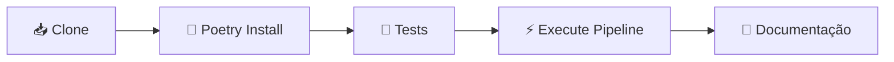

# 🏠 Estrutura Workshop — Documentação Principal

Bem-vindo à documentação do projeto "Como estruturar um projeto de dados do Zero". Este projeto demonstra boas práticas para desenvolvimento de pipelines ETL em Python.

## 📊 Sobre o Projeto

Este repositório é uma estrutura padronizada para projetos de engenharia, ciência e análise de dados, focando em:

- ✅ **Boas práticas de desenvolvimento**
- 🧪 **Testes automatizados**
- 📚 **Documentação completa**
- 🔄 **CI/CD e automação**
- 🐍 **Gerenciamento de ambientes Python**

## 🚀 Início Rápido



### Passos para começar:

1. **📥 Clone o repositório:**
```bash
git clone <URL-DO-REPO>
cd estrutura_workshop
```

2. **🐍 Instale dependências:**
```bash
poetry install
```

3. **🧪 Execute os testes:**
```bash
poetry run pytest -q
```

4. **⚡ Execute o pipeline:**
```bash
poetry run python src/main.py
```

5. **📖 Visualize a documentação:**
```bash
poetry run mkdocs serve
```

## 📋 Resumo e Links

Veja as páginas específicas para guias passo a passo e explicações completas:

### 🛠️ Configuração do Ambiente
- [⚙️ Setup](setup.md) - Instalação do Python, Poetry e configuração inicial
- [🔧 Pipeline](pipeline.md) - Visão detalhada do ETL (extract, transform, load)
- [🧪 Tests](tests.md) - Organização e execução de testes
- [🚀 CI](ci.md) - Workflows do GitHub Actions e integração contínua
- [🐍 Pyenv](pyenv.md) - Gerenciamento de versões do Python
- [🔍 Pre-commit](precommit.md) - Configuração de hooks (black, isort)
- [📂 Git](git.md) - Configuração do Git e boas práticas

### 💻 Documentação do Código
- [📖 Overview](codigo.md) - Visão geral da arquitetura do pipeline
- [🎯 Main](main.md) - Módulo principal do pipeline
- [📥 Extract](extract.md) - Extração de dados de arquivos Excel
- [🔄 Transform](transform.md) - Transformação e concatenação de dados
- [📤 Load](load.md) - Carregamento e salvamento dos resultados

## 🆘 Solução de Problemas

Se algo não estiver funcionando localmente (exemplo: `mkdocs serve` retornando erro), consulte a seção de troubleshooting em cada página específica ou verifique:

- ✅ **Python 3.12.7** está instalado
- ✅ **Poetry** está configurado corretamente
- ✅ **Dependências** foram instaladas: `poetry install`
- ✅ **Ambiente virtual** está ativo: `poetry shell`

---

*Documentação atualizada em 2025-10-16*
