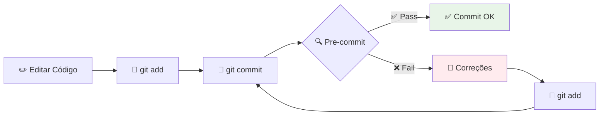

# 🔍 Pre-commit — Hooks de Qualidade

Esta página explica como o pre-commit funciona no projeto, garantindo qualidade e consistência do código antes de cada commit.

---

## 🎯 O que é Pre-commit?

O **pre-commit** é uma ferramenta que executa verificações automáticas antes de cada commit:

- ✅ **Formatação** consistente do código
- 🔍 **Verificações** de qualidade
- 🧹 **Limpeza** automática de arquivos
- 🚫 **Previne** commits com problemas

---

## ⚙️ Configuração do Projeto

### 📄 Arquivo `.pre-commit-config.yaml`

```yaml
repos:
  - repo: https://github.com/psf/black
    rev: 25.9.0
    hooks:
      - id: black
        language_version: python3.12

  - repo: https://github.com/PyCQA/isort
    rev: 5.12.0
    hooks:
      - id: isort
        name: isort
        language_version: python3.12

  - repo: https://github.com/pre-commit/pre-commit-hooks
    rev: v4.6.0
    hooks:
      - id: end-of-file-fixer
      - id: trailing-whitespace
```

---

## 🛠️ Hooks Configurados

### 🎨 **Black** - Formatador de Código
- **Função**: Formata código Python automaticamente
- **Configuração**: `line-length = 88`, `target-version = py312`
- **Benefício**: Código consistente, sem discussões sobre estilo

### 📋 **isort** - Organizador de Imports
- **Função**: Organiza e agrupa imports
- **Ordem**: Standard library → Third party → Local
- **Benefício**: Imports limpos e organizados

### 📄 **end-of-file-fixer** - Corretor de Final de Arquivo
- **Função**: Garante nova linha no final dos arquivos
- **Benefício**: Compatibilidade com ferramentas Unix

### 🧹 **trailing-whitespace** - Removedor de Espaços
- **Função**: Remove espaços desnecessários no final das linhas
- **Benefício**: Arquivos limpos, diffs menores

---

## 🚀 Instalação e Configuração

### 📦 **1. Instalar Pre-commit**
```bash
# Pre-commit já está nas dependências do projeto
poetry install
```

### ⚙️ **2. Ativar Hooks no Git**
```bash
# Instalar hooks localmente (uma vez por clone)
poetry run pre-commit install
```

### ✅ **3. Verificar Instalação**
```bash
# Testar se está funcionando
poetry run pre-commit --version
```

---

## 🔧 Usando Pre-commit

### 🤖 **Execução Automática**

Os hooks executam automaticamente a cada `git commit`:

```bash
git add .
git commit -m "feat: nova funcionalidade"

# Output:
black....................................................................Passed
isort....................................................................Passed
fix end of files.....................................................Passed
trim trailing whitespace.............................................Passed
[main abc1234] feat: nova funcionalidade
```

### 🛠️ **Execução Manual**

#### 🔍 **Todos os hooks, todos os arquivos**
```bash
poetry run pre-commit run --all-files
```

#### 🎯 **Hook específico**
```bash
# Apenas Black
poetry run pre-commit run black --all-files

# Apenas isort
poetry run pre-commit run isort --all-files
```

#### 📁 **Arquivos específicos**
```bash
# Apenas arquivos staged
poetry run pre-commit run

# Arquivo específico
poetry run pre-commit run --files src/main.py
```

---

## 🎨 Formatação de Código

### ⚡ **Task de Formatação (Recomendada)**
```bash
# Usando task do Poetry
poetry run task format
```

### 🔧 **Comandos Individuais**
```bash
# isort + black manualmente
poetry run isort .
poetry run black .

# Verificar apenas (sem alterar)
poetry run black --check .
poetry run isort --check .
```

### 🐚 **Com Shell Ativado**
```bash
# Ativar ambiente
poetry shell

# Executar formatação
task format

# Ou comandos individuais
isort .
black .
```

---

## 🔄 Fluxo de Trabalho

### 📝 **Desenvolvimento Normal**



### 🛠️ **Quando Hooks Fazem Correções**

```bash
# 1. Fazer commit
git commit -m "nova feature"

# 2. Se hooks corrigiram arquivos:
black....................................................................Failed
- hook id: black
- files were modified by this hook

# 3. Adicionar correções e commitar novamente
git add .
git commit -m "nova feature"
```

---

## 🧪 Validação e Teste

### ✅ **Verificar se Commit Passará**
```bash
# Testar todos os hooks antes de commitar
poetry run pre-commit run --all-files
```

### 🔍 **Debug de Problemas**
```bash
# Verbose mode para mais detalhes
poetry run pre-commit run --all-files --verbose

# Hook específico com debug
poetry run pre-commit run black --all-files --verbose
```

### 📊 **Status dos Hooks**
```bash
# Listar hooks instalados
poetry run pre-commit hooks

# Informações sobre configuração
poetry run pre-commit sample-config
```

---

## 🛠️ Solução de Problemas

### ❌ **"pre-commit command not found"**
```bash
# Instalar dependências
poetry install

# Verificar se pre-commit está disponível
poetry run pre-commit --version
```

### ❌ **Hooks não executam automaticamente**
```bash
# Reinstalar hooks
poetry run pre-commit uninstall
poetry run pre-commit install
```

### ❌ **Black/isort não encontrados**
```bash
# Atualizar hooks
poetry run pre-commit autoupdate

# Limpar cache
poetry run pre-commit clean
```

### ❌ **Erro de versão do Python**
```bash
# Verificar versão no .pre-commit-config.yaml
# Deve corresponder à versão do projeto (python3.12)

# Atualizar versão se necessário
poetry run pre-commit autoupdate
```

---

## ⚙️ Personalização

### 🔧 **Configurar Black (pyproject.toml)**
```toml
[tool.black]
line-length = 88
target-version = ["py312"]
```

### 📋 **Configurar isort (pyproject.toml)**
```toml
[tool.isort]
profile = "black"
multi_line_output = 3
```

### ➕ **Adicionar Novos Hooks**

Edite `.pre-commit-config.yaml`:
```yaml
  - repo: https://github.com/PyCQA/flake8
    rev: 6.1.0
    hooks:
      - id: flake8
```

---

## 🔗 Integração com CI

Os mesmos hooks executam no GitHub Actions:

```yaml
# .github/workflows/ci.yml
- name: Check formatting
  run: poetry run black --check .

- name: Check imports
  run: poetry run isort --check .
```

Veja mais detalhes em [🚀 CI](ci.md).

---

## 📚 Tasks do Projeto

O projeto define tasks úteis no `pyproject.toml`:

```bash
# Formatação completa
poetry run task format    # isort + black

# Executar testes
poetry run task test      # pytest com cobertura

# Executar pipeline
poetry run task run       # python src/main.py

# Documentação
poetry run task doc       # mkdocs serve
```

---

## 🔗 Próximos Passos

- 📂 **Configure Git**: [📂 Git](git.md)
- 🚀 **Configure CI**: [🚀 CI](ci.md)
- 🧪 **Execute Testes**: [🧪 Tests](tests.md)
- 🚀 **Execute Pipeline**: [📋 Pipeline](pipeline.md)
